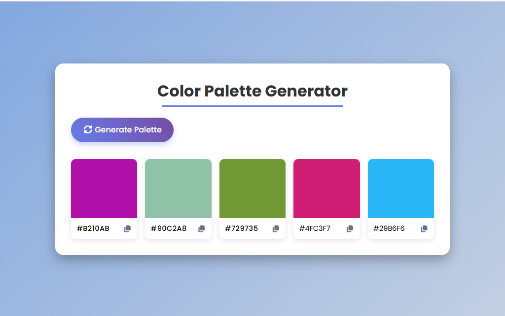

# Color Palette Generator 🎨

A simple and interactive **Color Palette Generator** built with **HTML, CSS, and JavaScript**.  
It allows users to generate random color palettes and copy color codes to the clipboard with a single click.

👉 [**Live Demo**](https://laibatariq110.github.io/color-palette-generator/)

---

## 🚀 Features
- Generate 5 random colors with one click.
- Copy hex color codes by clicking the copy button or the color box itself.
- Visual feedback when a color is copied (icon changes temporarily).
- Responsive layout for desktop and mobile.
- Modern UI design with smooth hover effects.

---

## 📂 Project Structure
├── index.html # Main HTML file
├── style.css # Stylesheet
├── script.js # JavaScript functionality
└── screenshot.png # Project preview

---

## 🖼️ Preview

---

## 🛠️ Technologies Used
- **HTML5**
- **CSS3** (Flexbox + Grid + Responsive Design)
- **JavaScript (ES6)**
- **Font Awesome** (for icons)
- **Google Fonts** (Poppins)

---

## ⚙️ How to Use
1. Clone or download this repository.
2. Open `index.html` in your browser.
3. Click **Generate Palette** to create new colors.
4. Click the **copy icon** (or the color box) to copy the hex code.

---

## 📌 Future Improvements (Optional Ideas)
- Allow users to save favorite palettes.
- Export palette as an image or JSON.
- Add more color formats (RGB, HSL).
- Share palettes on social media.

---

## ✨ Demo
You can run this project locally by simply opening `index.html`.  
(No build tools or dependencies required.)

---

## 📄 License
This project is open-source and free to use.
